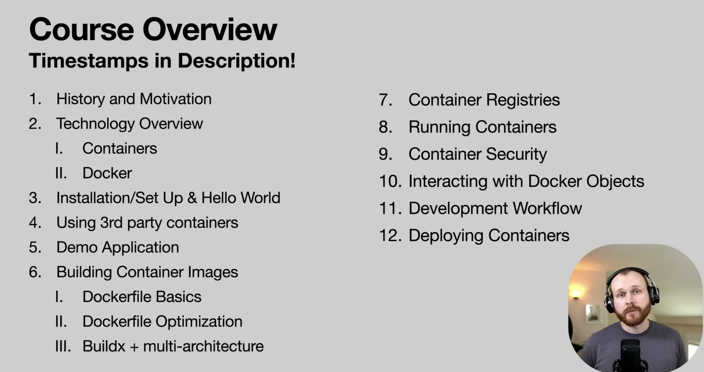
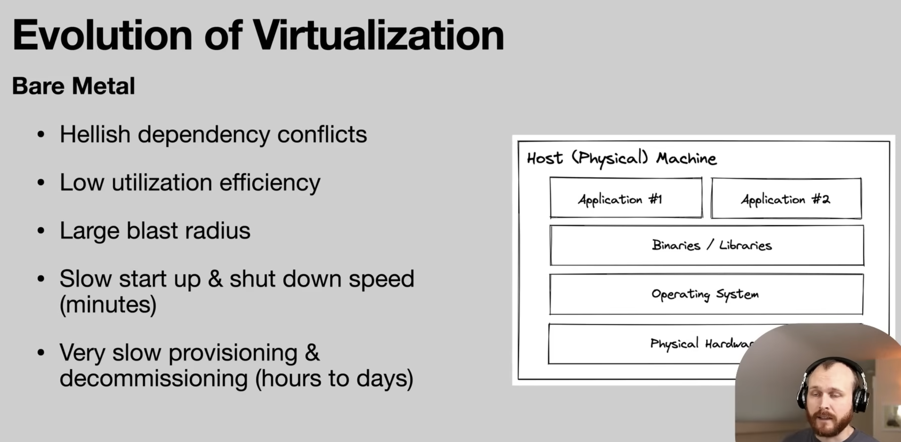
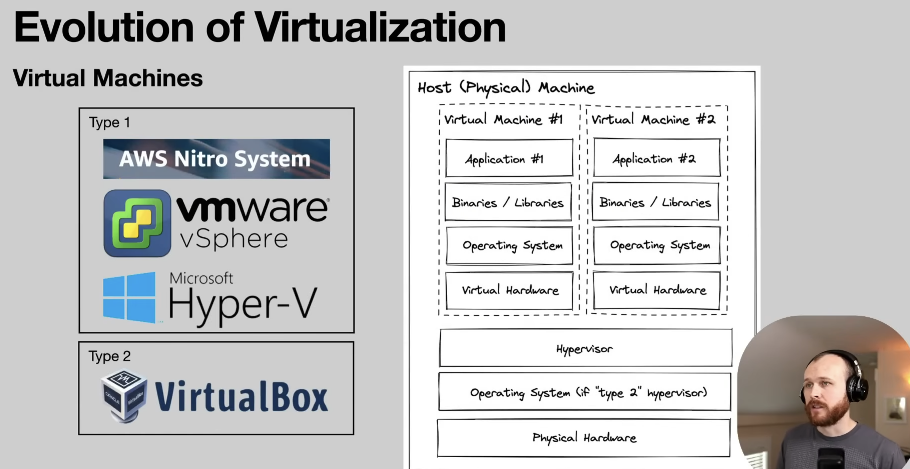
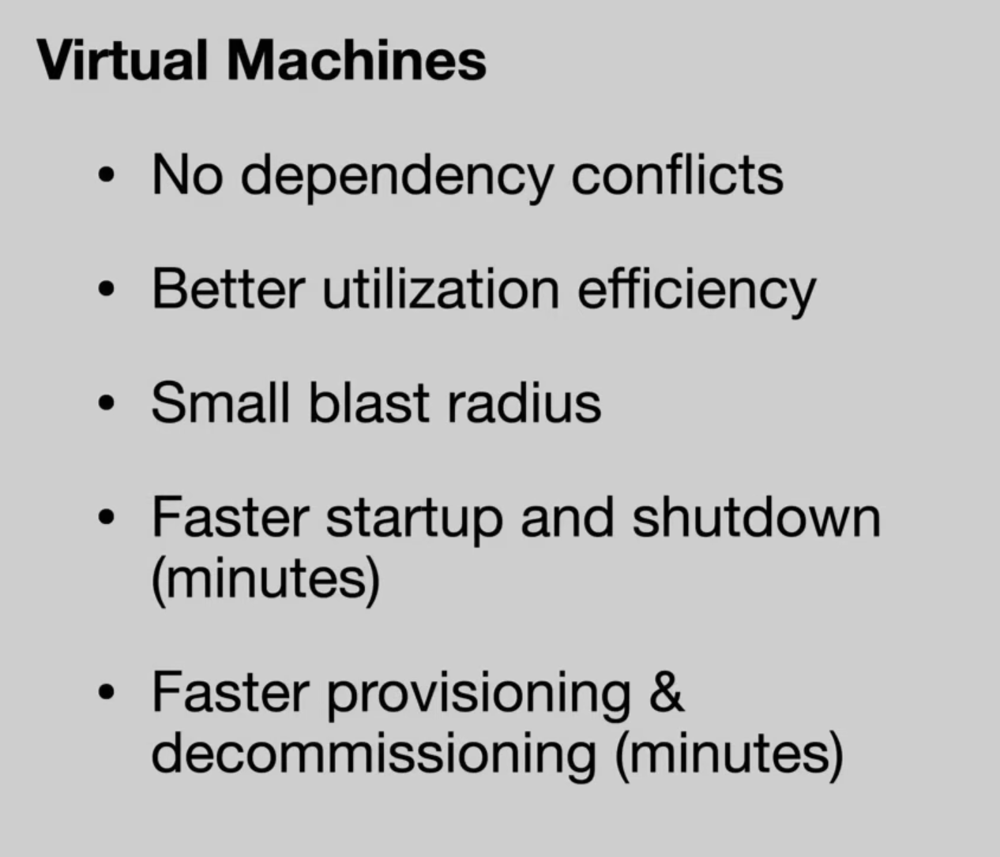
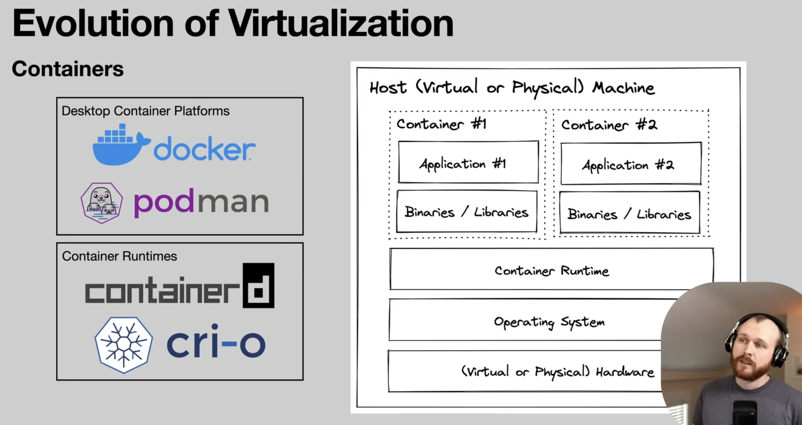
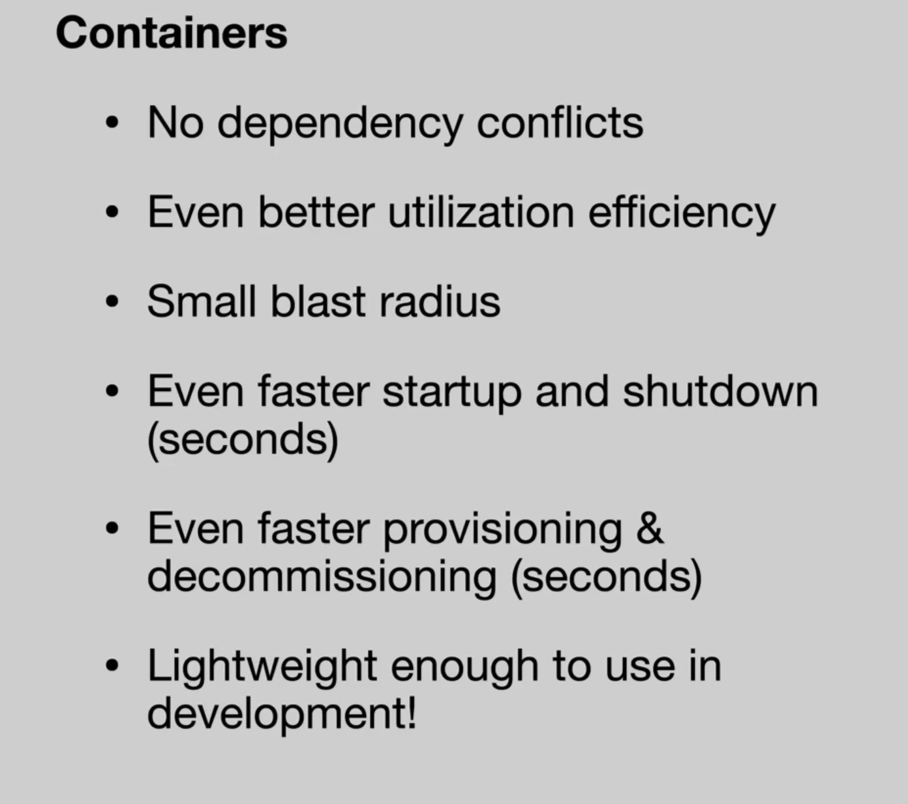
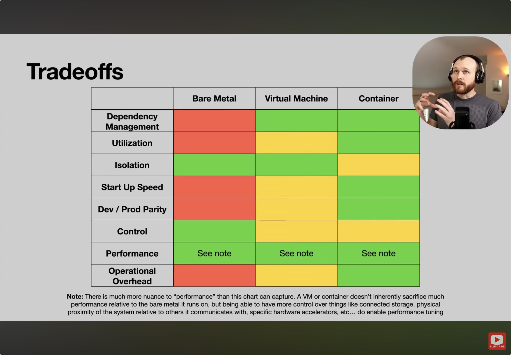
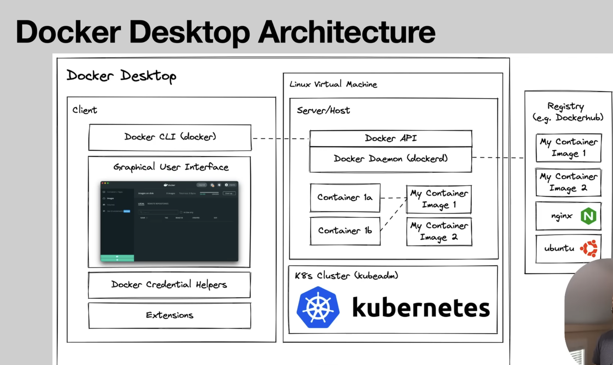
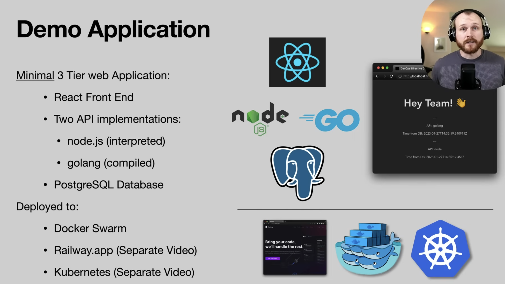

# Complete Docker Course - From BEGINNER to PRO! (Learn Containers)
Source:
https://www.youtube.com/watch?v=RqTEHSBrYFw
https://github.com/sidpalas/devops-directive-docker-course

## 1. History and Motivation
virtualisation techniques come from: bare metal
then: VMs
now: containers

A docker container is a ligthweight, standalone, executable package of software that includes everything needed to run an application.

Container image is an artifcat with all the dependencies in it. While a container is what you run from that image.
From Object-Oriented programming perspective: image is the class and the container itself is an instance of that class.

Few early players, Docker one of them, but instead of having the container technology vary slightly across them, there is the Open Container Initiative (OCI) pushing for open industry standards around container formats and runtimes. Collab of Google, Dell, VMWare, Docker,... Three things: 1. Runtime specification (how you take that image and run it in a container in adherence to the image), 2. Image specification (metadata, what should be included in the image and the format so a serialisable file system), and 3. Distribution specification (registries, pushing and pulling images).

Docker has a specific implementation of these OCI standards.

The evolution of virtualisation:

Hypervisor is some combo of software and hardware that allows us to carve up the physical resources into isolated smaller pools which we can then use to install our system on.
Type 1: no underlying OS. Beneficial: no performance sacrifice since everything runs directly on the hardware. E.g.: AWS Nitro, VMware Sphere.
Type 2: Virtual Box, classic on your own machine at home.

big advantage over bare metal: fast provisioning and decommissioning (look at cloud providers).

key difference VMs and containers: VMs run their own copy of the Linux kernel. This course will only treat Linux containers. While Linux containers are sharing their Linux kernel with the host operating system.

Small blast radius, but not quite as much as a virtual machine.

Bit of inception:
host machine with virtual machines and then containers on each. Typical Cloud set-up combining all three.
For managment across those VMs, is where K8S, Nomad, and Docker Swarm comes in for orchestration.

### Tradeoffs

## 2. Technology overview

### Containers

Dive into foundational Linux components that allow Docker containers to exist:
1. Namespaces: "wraps a global system resource in an abstraction that mkes it appear to the processes within the namespace that they have their own isolated instance of the global resource." Changes to the global res are visible to other processes in the same ns, but are invisible to other processes. E.g.: PID process, User namespace process --> map one uer within the container to another user in the host system (run as root user in container with proper config can map to non-root user outside of container).

2. Control Groups (cgroups): "a Linux kernel feature which allows processes to be organized into hierarchical groups whose usage of various types of resources can then be limited and monitored." --> terminal to list all cgroups: cat /proc/cgroups. E.g. of cgroups: cpu.shares , memory.limit_in_bytes, and blkio.throttle.read_bps_device. This allows to prevent noisy neighbour problem where one app is very resource hungry and starves the other apps.

3. Union Filesystem: Docker specifically uses Union Mount Filesystems (overlayfs); "allows files and directories of separate file systems, known as branches, to be transparently overlaid, forming a single coherent file system. Contents of directories which have the same path within the merged branches will be seen togheter in a single merged directory, within the new, virtual filesystem." --> You can have a lower layer filesys/directory and an upper layer which you can then see the merged view of with this overlayfs. Upper layer takes precedence over lower, so the version of a file in upper layer will be shown instead of the different version in lower layer, same with deleted files in upper that still exist in lower layer. The benefit / why it's essential to the Docker technology: this layered approach allows sharing lower layers and cache them which reduces amount of data needing to be transferred and stored for containers images because many images can share a same lower layer while only adjusting a few upper layer files when getting a container on a system AND allocate less space in case we are running multiple copies of the same container.

### Docker

So eventhough you can interact and set-up these components yourself, these three technologies combined into Docker makes it way more userfriendly by not needing to know all commands to create cgroups and move processes into them, or set-up namespaces and block off the different portions of our system.
--> Docker offers all of this with Docker Desktop app and a few commands we will look at later.

Docker Daemon (dockerd) manages container objects as well as networking, volumes etc. all within this server host application. So your commands you enter into the Docker CLI communicate with the API in the Linux machine in which the Docker Daemon executes all the different commands. --> the "Docker Enginer" = Docker CLI + Docker Daemon and Docker API (= opensource core of Docker).
Optional: install K8S cluster.
For MacOS: it uses a Linux VM
For Windows: WSL or HyperV
Registry: place to save and share your images, e.g.: DockerHub.

If all you do is build, run and interact with containers, only the Docker Engine might be enough. However, in this course we are using Docker for development so we will install Docker Desktop.

## 3. Installation/Set-up & Hello World

https://docs.docker.com/get-docker/

After install, open and go into settings --> resources --> limit accordingly to your machine.
Following command will show all possibile Docker COMMANDs:

`
docker
`

`
docker run docker/whalesay cowsay "🐷 wassup"
`

docker whalesay isn't supported anymore sadly. However, it would say that it can't find the image locally and start downloading it from DockerHub. Then you see several lines being downloaded which each correspond to one of the layers of the overlay filesystem. Downloads all those images to the host system so we can run a container from the image.

Something more useful: need pgql 
Password env var is necessary for container to run. Apart from that also publish port 5432 since otherwise we have no way of connecting to the isolated container running pgql. Publish says to connect local host port to that port on container.

`
docker run --env POSTGRES_PASSWORD= --publish 5432:5432 postgres:18.4-alpine
`

https://www.pgadmin.org/download/

check in PGAdmin that you see the pgqlDB in a docker container added. Add the Docker pgqlDB instance by adding a server with 0.0.0.0 and your added password. Then execute following query:

`
SELECT * FROM information_schema.tables
`

## 4. Using 3rd party containeres

## 5. Demo Application

## 6. Building container images

### Dockerfile basics
### Dockerfile optimisation
### Buildx + multi-architecture

## 7. Container registries

## 8. Running containers

## 9. Container security

## 10. Interacting with Docker objects

## 11. Development workflow

## 12. Deploying containers

